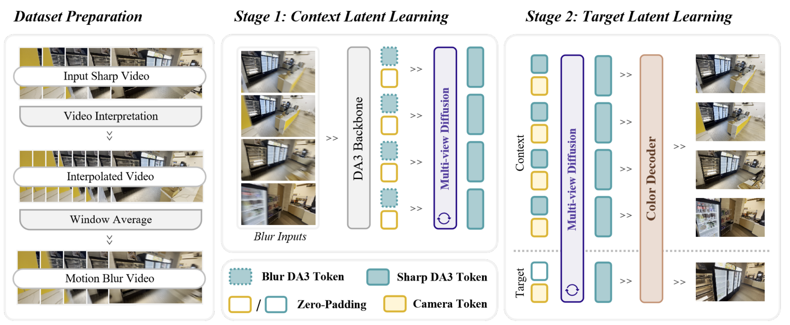

<div align="center">

# DeblurNVS: Geometric Latent Diffusion for Novel View Synthesis from Motion-Blurred Images

[Weights](https://huggingface.co/ChangyueShi/DeblurNVS) | [Project Page](https://github.com/ChangyueShi/Deblur-NVS) | [ArXiv](https://github.com/ChangyueShi/Deblur-NVS)

</div>

<p align="center">
  
</p>

A local demo release for our three-stage novel view synthesis pipeline.  
Given only motion-blurred multi-view input images, the system estimates DA3-native cameras, restores sharp context latents, synthesizes target-view latents along an interpolated trajectory, and decodes them into RGB novel views.

## Checklist

- [x] Release the demo code and pretrained weights.
- [ ] Release the full dataset and evaluation scripts.
- [ ] Release the training code.

## Quick Start

### 1. Install dependencies

Use your existing environment and install the required Python packages:

```bash
pip install -r requirements.txt
```

### 2. Prepare weights

Download or sync the released runtime assets into `pretrained/`.

Weights are hosted at:

```text
https://huggingface.co/ChangyueShi/DeblurNVS
```

After downloading, the `pretrained/` directory should look like:

```text
pretrained/
├── da3_base/
│   ├── config.json
│   └── model.safetensors
├── normalization_stats_level1.pt
├── stage1_lora.pt
├── stage2_diffusion.pt
└── stage3_decoder.pt
```

## Repository Layout

```text
deblurnvs_opensource/
├── deblurnvs/          # demo runtime
├── example/            # bundled input-only example scene
├── pretrained/         # all local runtime assets
├── utils/              # local helper code and lightweight model components
├── requirements.txt
└── run_demo.py
```

## Input Format

Each scene should contain blurred input images in one of the following layouts:

```text
scene_root/
└── images_train/
    ├── 000.png
    ├── 001.png
    └── ...
```

## Run the Example

```bash
python run_demo.py \
  --scene-root example \
  --context-views 9 \
  --num-novel-views 25 \
  --output-dir outputs/demo_interp \
  --device cuda:0
```

## Output Format

```text
outputs/demo_interp/
├── context_views/
├── context_views_pred/
├── pred/
├── overview.png
├── camera_path.json
└── metadata.json
```

| Output | Description |
| --- | --- |
| `context_views/` | input blurred context images |
| `context_views_pred/` | reconstructed RGB predictions for observed views |
| `pred/` | interpolated novel-view RGB predictions |
| `overview.png` | compact visual summary |
| `camera_path.json` | exported interpolated target-camera path |
| `metadata.json` | run configuration and checkpoint metadata |

## Citation

This is a demo repository. Some implementation details may differ slightly from the final paper version.
